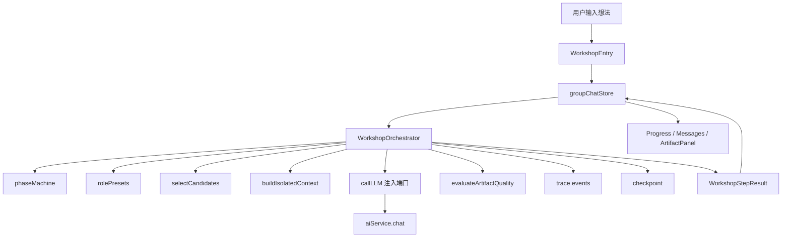

# 架构设计 — AI 圆桌工作坊 v3.0

> 创建: 2026-06-28  
> 目标: 在现有 `agents` 模块上构建阶段受控的专家圆桌工作流  
> 约束: 遵守 ADR 0001，不把 1v1、群聊、工作坊重新混入同一个 Store

---

## 一、背景与现状

现有系统已经存在三类能力：

| 能力 | 现状 | 结论 |
|------|------|------|
| Agent 实体 | `store/useAgentStore.ts` + `data/agents.json` | 继续复用。 |
| Agent 1v1 对话 | `modules/agents/stores/agentChatStore.ts` + `data/agent_chats.json` | 按 ADR 0001 保持独立。 |
| 群聊 | `modules/agents/stores/groupChatStore.ts` + `data/group_chats.json` | 工作坊应基于群聊域扩展。 |
| ChatStrategy | `EventDrivenStrategy`、`SerialStrategy`、`PassiveStrategy` | 可作为编排层的已有基础。 |
| AI 通用聊天 | `components/chat/*` + `store/useChatStore.ts` | 不作为 v3.0 工作坊主承载。 |

旧 v2.0 文档提出“合并到 AI 聊天模块”，但代码和 ADR 已经走向“1v1 与群聊分离”。v3.0 采用现实架构：**AI 圆桌工作坊是群聊域上的受控工作流模式**。

---

## 二、质量目标 → 设计维度映射

| 质量属性 | 设计手段 | 对应维度 |
|----------|----------|----------|
| 可靠性 | 阶段状态机、单 Agent 失败降级、请求竞态守卫。 | 错误处理、数据流 |
| 可维护性 | 工作坊编排独立于页面组件，UI 只消费状态。 | 项目结构、设计原则 |
| 可扩展性 | 角色模板、阶段定义、策略执行分离。 | 接口与契约、设计原则 |
| 性能效率 | 阶段内可并行，阶段间串行；限制最大轮数和上下文长度。 | 数据流 |
| 可测试性 | 核心编排为纯逻辑，LLM 调用通过依赖注入。 | 可测试性设计 |
| 可观测性 | 每个阶段记录状态、失败原因、产物版本。 | 错误处理 |
| 安全性 | 用户输入只进入当前会话；失败不泄露 API Key。 | 接口与契约、错误处理 |
| 兼容性 | 不迁移现有 `agent_chats.json` / `group_chats.json`；新增字段可选。 | 接口与契约 |
| 可移植性 | 不依赖浏览器外的专有状态；沿用现有文件存储。 | 项目结构 |

---

## 三、核心架构决策

### 3.1 工作坊归属

**决策**：AI 圆桌工作坊归属于 `modules/agents`，不是 `modules/ai`。

原因：

- 工作坊的核心是多 Agent 协作，不是普通 AI 聊天。
- ADR 0001 已明确 1v1 与群聊分离。
- 现有 `AgentsChatPage` 已经承载 1v1 与群聊入口。
- 继续扩展 `useChatStore` 会造成第四套语义冲突。

### 3.2 数据模型策略

**决策**：MVP 不新增第三套聊天存储。工作坊作为群聊的一种模式，扩展 `GChat` 的可选字段。

建议字段：

```typescript
type GroupChatMode = 'free' | 'workshop'

interface WorkshopState {
  topic: string
  phase: WorkshopPhase
  roles: WorkshopRoleSnapshot[]
  artifacts: WorkshopArtifact[]
  checkpoint?: WorkshopCheckpoint
  trace: WorkshopTraceEvent[]
  quality?: QualityGateResult
  incompleteReason?: string
  status: 'idle' | 'clarifying' | 'running' | 'paused' | 'completed' | 'failed'
  currentRunId?: string
  createdAt: number
  updatedAt: number
}

interface GChat {
  // existing fields...
  mode?: GroupChatMode
  workshop?: WorkshopState
}
```

兼容规则：

- 旧群聊没有 `mode` 字段时视为 `free`。
- `mode === 'workshop'` 时才读取 `workshop`。
- `workshop` 缺失或损坏时降级为普通群聊，并提示用户重新开始工作坊。
- `mode` 决定会话类型：普通群聊还是圆桌工作坊。
- `strategy` 仍表示群聊调度策略；在 `mode === 'workshop'` 时，它只能作为工作坊内部某阶段的调度参考，不能决定工作坊流程。
- 实现时不得只用 `strategy` 判断是否进入工作坊；必须以 `mode === 'workshop' && workshop` 为准。

### 3.3 编排模块

**决策**：新增深度模块 `WorkshopOrchestrator`，隐藏阶段推进、角色调度、失败降级和产物生成。

推荐接口：

```typescript
interface WorkshopOrchestrator {
  start(ctx: WorkshopStartContext): Promise<WorkshopStepResult>
  continue(ctx: WorkshopContinueContext): Promise<WorkshopStepResult>
}
```

该接口小，但背后隐藏：

- 信息充分性判断
- 阶段状态机
- 专家角色选择
- 并行/串行发言
- 风险审查
- 结构化产物生成
- 单 Agent 失败降级
- 最大轮数和上下文压缩

删除测试：

- 删除 `WorkshopOrchestrator` 后，页面组件必须自己处理阶段、策略、产物、失败降级，复杂度会扩散到 UI。因此该模块有价值。

### 3.4 先进协作模式取舍

v3.0 采用“Supervisor + Pipeline + Debate + Quality Gate”的组合，不采用自由 Swarm：

| 模式 | 是否采用 | 用法 |
|------|----------|------|
| Supervisor | 采用 | 主持人/编排器负责阶段推进、候选池、收敛。 |
| Pipeline | 采用 | 澄清 → 发散 → 质疑 → 收敛 → 产出按固定阶段推进。 |
| Debate | 采用 | 风险官与被质疑专家形成有限轮反方审查。 |
| Evaluator-Optimizer | 轻量采用 | 质量门禁检查产物，最多重写 2 次。 |
| Swarm | 暂不采用 | 自由转交不可控，容易无限循环和职责漂移。 |
| Hierarchical | 暂不采用 | 当前 6 个角色无需多层主管结构。 |

新增设计规则：

- 发散阶段第一轮使用上下文隔离，专家彼此不可见，避免锚定偏差。
- 每个阶段通过 `selectCandidates()` 纯函数生成发言候选池。
- 最终产物通过 `evaluateArtifactQuality()` 纯函数按固定 rubric 检查。
- 关键阶段提供用户检查点，允许用户改变重点或暂停。
- 每次运行写入最小可观测记录，便于调试与恢复。

实现约束：

- `WorkshopOrchestrator` 是本阶段唯一需要保持“深模块”形态的编排模块。
- `candidateSelector`、`contextIsolation`、`qualityGate`、`artifactBuilder` 在 MVP 阶段优先实现为纯函数文件，不定义单实现接口或类。
- 只有当同一规则出现至少两个真实适配器时，才考虑抽象接口。

---

## 四、项目结构

推荐新增与调整：

```text
个人工作台/src/modules/agents/
  pages/
    AgentsChatPage.tsx              # 扩展入口，不承载编排细节
  workshop/
    types.ts                        # WorkshopPhase / Role / Artifact / Result
    rolePresets.ts                  # 默认专家组
    phaseMachine.ts                 # 纯逻辑阶段流转
    candidateSelector.ts            # selectCandidates() 纯函数
    contextIsolation.ts             # buildIsolatedContext() 纯函数
    artifactBuilder.ts              # 结构化产物生成规则
    qualityGate.ts                  # evaluateArtifactQuality() 纯函数
    WorkshopOrchestrator.ts         # 深度编排模块
    __tests__/
      phaseMachine.test.ts
      candidateSelector.test.ts
      qualityGate.test.ts
      artifactBuilder.test.ts
      WorkshopOrchestrator.test.ts
  components/
    WorkshopEntry.tsx               # 想法输入和模式选择
    WorkshopProgress.tsx            # 阶段进度
    WorkshopRoleRail.tsx            # 专家组侧栏
    WorkshopArtifactPanel.tsx       # 最终产出卡片
  stores/
    groupChatStore.ts               # 扩展 mode/workshop 可选字段

个人工作台/src/types/
  agent.ts                          # 必要时扩展 ChatAgent 快照字段
```

不建议：

- 不新增 `workshopStore.ts`，除非后续产物生命周期明显独立于群聊。
- 不让 `AgentsChatPage.tsx` 直接拼接复杂 prompt。
- 不让 `WorkshopArtifactPanel` 反向修改 Store。
- 不为只有一个实现的规则模块创建接口或类。

---

## 五、接口与契约

### 5.1 阶段定义

```typescript
type WorkshopPhase =
  | 'clarify'
  | 'diverge'
  | 'challenge'
  | 'converge'
  | 'artifact'
  | 'completed'
```

阶段不变量：

- `clarify` 只能由用户输入或主持人判断触发。
- `diverge` 至少需要一个专家角色。
- `challenge` 必须有风险官或主持人代行。
- `artifact` 必须基于前序阶段消息生成。
- `completed` 后默认只允许追问，不自动重跑全流程。

### 5.2 角色快照

```typescript
interface WorkshopRoleSnapshot {
  roleId: string
  agentId: string
  name: string
  responsibility: string
  required: boolean
}
```

角色快照原则：

- 工作坊创建时复制 Agent 关键信息，保证历史一致性。
- 后续 Agent 改名或删除，不影响已有圆桌会话回放。
- 必选角色缺失时，允许主持人代行，但产物要标记“不完整”。

### 5.3 结构化产物

```typescript
interface WorkshopArtifact {
  id: string
  version: number
  title: string
  goal: string
  nonGoals: string[]
  targetUsers: string[]
  userPath: string[]
  mvpScope: string[]
  implementationNotes: string[]
  risks: string[]
  nextSteps: string[]
  createdAt: number
}
```

产物不变量：

- 不保存空产物。
- 每次重新生成产物递增 `version`。
- 风险必须至少包含“范围风险”或“实现风险”之一。

### 5.4 发言候选池

```typescript
interface SpeakerCandidateRule {
  phase: WorkshopPhase
  allowedRoleIds: string[]
  requireIndependentDraft?: boolean
  maxSpeakers?: number
}

function selectCandidates(ctx: CandidateSelectionContext): CandidateSelectionResult
```

候选池不变量：

- `clarify` 阶段只允许主持人。
- `diverge` 阶段必须先返回需要独立初稿的专家角色。
- `challenge` 阶段必须包含风险官；若风险官缺失，主持人代行并标记不完整。
- 候选池为空时不得继续执行该阶段。

### 5.5 质量门禁

```typescript
interface QualityGateResult {
  passed: boolean
  score: number
  missingFields: string[]
  revisionHint?: string
}

function evaluateArtifactQuality(artifact: WorkshopArtifact): QualityGateResult
```

质量门禁固定检查：

- 目标定义。
- 不做什么。
- MVP 范围。
- 用户路径。
- 技术实现建议。
- 风险与取舍。
- 下一步计划。

质量门禁最多触发 2 次重写，避免无限反思循环。

### 5.6 用户检查点与可观测记录

```typescript
interface WorkshopCheckpoint {
  phase: WorkshopPhase
  reason: 'need-user-clarification' | 'choose-direction' | 'choose-output-bias'
  prompt: string
  options: string[]
  createdAt: number
}

interface WorkshopTraceEvent {
  id: string
  runId: string
  phase: WorkshopPhase
  type: 'phase-started' | 'speaker-selected' | 'agent-succeeded' | 'agent-failed' | 'agent-skipped' | 'quality-checked' | 'checkpoint-created'
  roleId?: string
  reason?: string
  createdAt: number
}
```

检查点不变量：

- `checkpoint` 存在时，`status` 必须为 `paused`。
- 用户恢复后必须清空 `checkpoint`，并写入一条 trace。
- trace 只记录运行元信息和失败原因，不保存 API Key、完整 prompt 或敏感内容。

---

## 六、数据流与状态管理



状态归属：

| 状态 | 归属 | 原因 |
|------|------|------|
| Agent 实体 | `useAgentStore` | 多处复用的唯一数据源。 |
| 群聊消息 | `groupChatStore` | ADR 0001 已确定。 |
| 工作坊阶段 | `GChat.workshop.phase` | 与群聊会话同生命周期。 |
| 当前请求 ID | 页面本地 ref 或 store 运行态 | 防止切换会话后串消息。 |
| 结构化产物 | `GChat.workshop.artifacts` | 需要随会话持久化。 |
| 可观测记录 | `GChat.workshop.trace` 或等价轻量字段 | 记录阶段、发言、失败、质量门禁结果。 |
| 输入框内容 | 页面本地状态 | 只被当前 UI 使用。 |

---

## 七、错误处理

| 场景 | 策略 | 用户反馈 |
|------|------|----------|
| 单个专家调用失败 | 记录失败，继续其他专家。 | 专家卡显示“本轮失败，可重试”。 |
| 必选角色缺失 | 主持人代行或阻止开始。 | “缺少风险官，结果可能不完整”。 |
| API Key 缺失 | 跳过该 Agent，不暴露 Key 细节。 | “该专家未配置可用模型”。 |
| 阶段执行超时 | 中断本阶段，保留已完成输出。 | “本阶段未完整完成，可继续或重试”。 |
| 产物解析失败 | 保留原始总结，允许重新生成。 | “结构化整理失败，已保留讨论记录”。 |
| 会话切换 | 忽略过期 runId 的结果。 | 不打扰用户，必要时显示状态已暂停。 |
| Store 读取失败 | 降级为空列表并记录日志。 | 按现有存储策略处理。 |

错误分类：

- 业务异常：缺少专家、输入为空、用户跳过澄清。
- 技术异常：LLM 超时、存储失败、产物解析失败。

---

## 八、可测试性设计

| 模块 | 测试方式 | 断言重点 |
|------|----------|----------|
| `phaseMachine` | 单元测试 | 阶段只能按合法顺序推进。 |
| `rolePresets` | 单元测试 | 默认专家组完整且职责不重复。 |
| `candidateSelector` | 单元测试 | 各阶段只返回合法候选专家。 |
| `contextIsolation` | 单元测试 | 独立初稿不包含其他专家第一轮观点。 |
| `qualityGate` | 单元测试 | 缺字段时失败，完整产物通过。 |
| `artifactBuilder` | 单元测试 | 能从阶段记录生成结构化产物，空内容失败。 |
| `WorkshopOrchestrator` | 单元测试 | mock LLM，验证澄清、发散、质疑、产出流程。 |
| `groupChatStore` 扩展 | Store 测试 | 旧群聊兼容，新工作坊字段持久化。 |
| UI 组件 | 组件测试 | 阶段、失败态、产物卡正确显示。 |
| 完整路径 | E2E / 手动 | 输入想法到最终产物的关键路径。 |

依赖注入原则：

- `WorkshopOrchestrator` 不直接 import `aiService.chat`。
- LLM 调用通过 `callLLM` 注入。
- 时间和 ID 生成在测试中可替换。

---

## 九、架构健康检查

| 检查项 | 设计结果 |
|--------|----------|
| 模块职责清晰 | 编排、阶段、角色、产物、UI 分离。 |
| 接口稳定 | `WorkshopOrchestrator` 暴露 start/continue，隐藏复杂流程。 |
| 接口深度 | 小接口背后封装阶段机、角色调度、降级和产物生成。 |
| 依赖方向正确 | UI 依赖编排接口，编排依赖 LLM 注入端口，不依赖具体服务。 |
| 错误有处理 | 单专家失败、超时、解析失败都有降级。 |
| 可测试 | 核心逻辑纯化，LLM、时间、ID 注入。 |
| 无过度设计 | MVP 不新增 Store，不引入复杂流程编辑器。 |
| 副作用隔离 | Store 写入和 LLM 调用在边界层，核心规则可单测。 |

---

## 十、禁止行为检查

- 不在 `AgentsChatPage.tsx` 内堆积完整工作坊流程。
- 不新增第三套聊天 Store。
- 不推翻 ADR 0001。
- 不把 `ChatStrategy` 扩成巨型接口。
- 不吞掉专家失败后仍显示“分析完整”。
- 不把只属于 UI 的临时状态提升到共享 Store。
- 不在第一次出现可配置需求时就做复杂流程编排器。

---

## 十一、ADR 影响

本设计遵守 `docs/adr/0001-agent-chat-separation.md`。

暂不需要新增 ADR，因为 v3.0 文档选择是在既有 ADR 内扩展。如果后续实现决定新增独立 `workshopStore.ts` 或迁移旧群聊数据，则必须创建新的 ADR。

---

## 十二、更新记录

| 时间 | 更新内容 |
|------|----------|
| 2026-06-28 | 创建 AI 圆桌工作坊 v3.0 架构设计。 |
| 2026-06-28 | 补充 Supervisor + Pipeline + Debate + Quality Gate 组合方案，以及候选池、上下文隔离、质量门禁、可观测记录模块。 |
| 2026-06-28 | 小修架构规范：明确规则模块纯函数优先、补全 `WorkshopState` 字段、澄清 `mode` 与 `strategy` 边界、更新数据流图。 |
