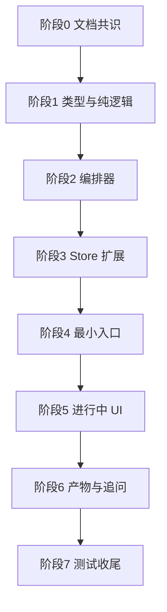

# 任务拆解 — AI 圆桌工作坊 v3.0

> 创建: 2026-06-28  
> 原则: 垂直切片、逐步验证、不破坏现有 1v1 与群聊  
> 当前状态: 阶段 0-1 已完成；阶段 2（WorkshopOrchestrator 编排器）待开始

---

## 当前进度总览

| 阶段 | 名称 | 状态 | 说明 |
|------|------|------|------|
| 0 | 文档与共识 | ✅ 已完成 | CONTEXT、功能规范、架构、任务拆解、测试方案 |
| 1 | 类型与纯逻辑基础 | ✅ 已完成 | 7 个纯逻辑模块 + `workshopPureLogic.test.ts` 10/10 |
| 2 | 工作坊编排器 | ⏳ 下一步 | 实现 `WorkshopOrchestrator`（mock LLM，无 UI） |
| 3 | 群聊 Store 扩展 | ⏸ 未开始 | 扩展 `GChat.mode` / `workshop` 字段 |
| 4 | 最小 UI 入口 | ⏸ 未开始 | `WorkshopEntry` + Agents 模块入口 |
| 5 | 进行中 UI | ⏸ 未开始 | 进度、专家侧栏、讨论接入 |
| 6 | 产物与追问 | ⏸ 未开始 | 结构化方案卡、追问、重生成 |
| 7 | 测试收尾 | ⏸ 未开始 | 全量测试与手动验收 |

**代码落点**：`个人工作台/src/modules/agents/workshop/`（阶段 1 已落地，尚无 `WorkshopOrchestrator.ts`）

**最近验证**：`npm run test -- src/modules/agents/workshop/__tests__/workshopPureLogic.test.ts` → 10/10 通过

---

## 一、总目标

把现有“智能体群聊”能力升级为产品化的“AI 圆桌工作坊”：用户输入模糊想法后，系统按阶段组织多位专家 Agent 分析、质疑、收敛，并输出结构化方案。

本任务不是一次性大改，而是按可验证切片推进：

```
术语与类型
  → 工作坊核心逻辑
  → 群聊 Store 兼容扩展
  → 最小 UI 入口
  → 完整圆桌流程
  → 产物与追问
  → 测试与验证
```

---

## 二、阶段 0：文档与共识 ✅

| 子步骤 | 任务 | 验证方式 | 回退方式 |
|--------|------|----------|----------|
| 0.1 | 建立 `CONTEXT.md` 术语：AI 圆桌工作坊、阶段、专家角色、结构化产出。 | 人工检查术语一致性。 | 删除或修订术语条目。 |
| 0.2 | 编写功能设计规范。 | 对照功能清单、用户路径、布局草图、状态覆盖。 | 回退规范文件。 |
| 0.3 | 编写架构设计。 | 对照 ADR 0001 与健康架构检查清单。 | 回退架构文件。 |
| 0.4 | 编写任务拆解与测试方案。 | 每步可独立验证。 | 回退任务与测试文件。 |

退出标准：

- 文档能独立说明做什么、不做什么、怎么做、怎么测。
- 新旧“智能体群聊”与“AI 圆桌工作坊”边界清楚。

---

## 三、阶段 1：类型与纯逻辑基础 ✅

目标：不碰 UI，不碰真实 LLM，先建立可测试核心。

**完成记录（2026-06-28）**：已实现全部 1.1-1.7；定向单元测试 10/10 通过。

| 子步骤 | 任务 | 验证方式 | 回退方式 |
|--------|------|----------|----------|
| 1.1 | 新建 `modules/agents/workshop/types.ts`，定义 `WorkshopPhase`、`WorkshopState`、`WorkshopRoleSnapshot`、`WorkshopArtifact`、`WorkshopCheckpoint`、`WorkshopTraceEvent`、`QualityGateResult`。 | `tsc --noEmit`。 | 删除新增类型文件。 |
| 1.2 | 新建 `rolePresets.ts`，定义默认专家组。 | 单元测试：角色完整、职责不重复、必选角色存在。 | 删除文件或恢复默认专家组。 |
| 1.3 | 新建 `phaseMachine.ts`，实现阶段推进规则。 | 单元测试：合法流转通过，非法流转失败。 | 删除文件。 |
| 1.4 | 新建 `artifactBuilder.ts`，定义结构化产物生成与校验。 | 单元测试：空内容失败，完整记录成功。 | 删除文件。 |
| 1.5 | 新建 `candidateSelector.ts`，实现 `selectCandidates()` 纯函数。 | 单元测试：澄清只选主持人、质疑包含风险官、候选池为空失败。 | 删除文件。 |
| 1.6 | 新建 `contextIsolation.ts`，实现 `buildIsolatedContext()` 纯函数。 | 单元测试：独立初稿不包含其他专家第一轮观点。 | 删除文件。 |
| 1.7 | 新建 `qualityGate.ts`，实现 `evaluateArtifactQuality()` 纯函数。 | 单元测试：缺少 MVP/风险/下一步时失败，完整产物通过。 | 删除文件。 |

退出标准：

- 核心类型和纯逻辑测试通过。
- 没有引入 Store 或 UI 副作用。
- 下一阶段可以直接基于这些纯逻辑实现编排器，不需要重写类型。
- 规则模块保持纯函数，不引入只有一个实现的接口或类。

---

## 四、阶段 2：工作坊编排器 ⏳ 当前阶段

目标：用一个深度模块封装圆桌流程。

| 子步骤 | 任务 | 验证方式 | 回退方式 |
|--------|------|----------|----------|
| 2.1 | 新建 `WorkshopOrchestrator.ts`，暴露 `start()` / `continue()`。 | 单元测试 mock LLM，验证接口输出。 | 删除编排器。 |
| 2.2 | 实现澄清阶段：判断信息是否足够，生成最多 3 个问题。 | 单元测试：短输入进入澄清，完整输入可跳过。 | 回退该阶段逻辑。 |
| 2.3 | 实现发散阶段独立初稿：专家第一轮互不可见。 | 单元测试：专家上下文不包含其他专家第一轮观点。 | 回退独立初稿逻辑。 |
| 2.4 | 实现质疑阶段：风险官提出可处理风险，被质疑专家可回应。 | 单元测试：风险为空时产物不通过。 | 回退质疑逻辑。 |
| 2.5 | 实现收敛与产出阶段：生成结构化方案并进入质量门禁。 | 单元测试：产物字段完整、版本递增。 | 回退产物生成。 |
| 2.6 | 实现质量门禁重写：最多 2 次，不无限循环。 | 单元测试：不合格产物触发重写，达到上限后标记未达标。 | 回退质量门禁接入。 |
| 2.7 | 实现用户检查点：澄清后、发散后、产出前可暂停。 | 单元测试：检查点状态可暂停和恢复。 | 回退检查点逻辑。 |
| 2.8 | 实现单 Agent 失败降级与可观测记录。 | 单元测试：一个专家失败不阻塞整体，并记录 trace。 | 回退降级分支。 |

退出标准：

- 无 UI 情况下可从输入想法得到 `WorkshopStepResult`。
- LLM 调用全部通过注入，测试不依赖真实 API。
- 独立初稿、候选池、质量门禁、用户检查点至少有单元测试覆盖。

---

## 五、阶段 3：群聊 Store 兼容扩展

目标：在不迁移旧数据的前提下，让群聊支持工作坊模式。

| 子步骤 | 任务 | 验证方式 | 回退方式 |
|--------|------|----------|----------|
| 3.1 | 扩展 `GChat`：新增可选 `mode?: 'free' | 'workshop'` 与 `workshop?: WorkshopState`。 | `tsc --noEmit`。 | 删除新增字段。 |
| 3.2 | 扩展 `groupChatStore`：创建工作坊群聊、更新阶段、保存产物。 | Store 单元测试。 | 回退 Store 方法。 |
| 3.3 | 兼容旧群聊：无 `mode` 视为 `free`。 | 单元测试读取旧数据样本。 | 回退兼容逻辑。 |
| 3.4 | 加入 `runId` 或等价竞态保护字段。 | 单元测试：过期结果不写入当前会话。 | 回退竞态字段。 |

退出标准：

- 旧群聊数据不需要迁移也能正常显示。
- 工作坊状态可持久化和恢复。

---

## 六、阶段 4：最小 UI 入口

目标：用户能启动一个圆桌工作坊，但先不追求完整视觉打磨。

| 子步骤 | 任务 | 验证方式 | 回退方式 |
|--------|------|----------|----------|
| 4.1 | 新建 `WorkshopEntry.tsx`，提供想法输入、快速/深度模式选择。 | 组件测试或手动验证。 | 删除入口组件。 |
| 4.2 | 在 `AgentsChatPage` 的群聊区域加入“圆桌工作坊”入口。 | 手动验证不影响 1v1 和普通群聊。 | 移除入口。 |
| 4.3 | 创建工作坊会话后写入 `groupChatStore`。 | Store + 手动验证。 | 回退创建逻辑。 |
| 4.4 | 输入校验：空输入 disabled，过短输入进入澄清。 | 组件测试。 | 回退校验。 |

退出标准：

- 用户能从 Agent 模块启动工作坊。
- 普通群聊入口仍可用。

---

## 七、阶段 5：工作坊进行中 UI

目标：让用户看见阶段、专家和讨论过程。

| 子步骤 | 任务 | 验证方式 | 回退方式 |
|--------|------|----------|----------|
| 5.1 | 新建 `WorkshopProgress.tsx` 显示阶段进度。 | 组件测试：阶段文案正确。 | 删除组件。 |
| 5.2 | 新建 `WorkshopRoleRail.tsx` 显示专家组状态。 | 组件测试：成功/失败/等待态。 | 删除组件。 |
| 5.3 | 接入 `WorkshopOrchestrator`，将步骤结果写入群聊消息。 | 集成测试或手动验证。 | 回退接入点。 |
| 5.4 | 处理专家失败态和重试入口。 | 手动验证 API 缺失/失败场景。 | 回退失败 UI。 |
| 5.5 | 切换会话时中断或忽略旧请求。 | 手动验证竞态。 | 回退请求守卫。 |

退出标准：

- 用户能看到“当前进行到哪一步”。
- 单个专家失败不会让整个 UI 卡死。

---

## 八、阶段 6：结构化产物与追问

目标：让圆桌结果真正可用。

| 子步骤 | 任务 | 验证方式 | 回退方式 |
|--------|------|----------|----------|
| 6.1 | 新建 `WorkshopArtifactPanel.tsx` 展示最终方案。 | 组件测试：字段完整显示。 | 删除组件。 |
| 6.2 | 支持保存产物版本。 | Store 单元测试。 | 回退版本逻辑。 |
| 6.3 | 支持对专家追问或 @专家继续对话。 | 手动验证。 | 回退追问入口。 |
| 6.4 | 支持“重新生成总结”。 | 单元/手动验证版本递增。 | 回退重生成入口。 |
| 6.5 | 预留“生成任务拆解”按钮但不自动执行开发流程。 | 手动验证按钮说明。 | 隐藏按钮。 |

退出标准：

- 最终产物可读、可保存、可追问。
- 不会绕过用户确认直接进入开发。

---

## 九、阶段 7：测试、验证与收尾

| 子步骤 | 任务 | 验证方式 | 回退方式 |
|--------|------|----------|----------|
| 7.1 | 补齐工作坊纯逻辑单元测试。 | `vitest` 指定测试通过。 | 回退测试或逻辑。 |
| 7.2 | 补齐 Store 兼容测试。 | 旧群聊样本 + 新工作坊样本。 | 回退 Store 变更。 |
| 7.3 | 补齐 UI 组件关键状态测试。 | 组件测试或人工记录。 | 回退 UI。 |
| 7.4 | 全量 `tsc --noEmit`。 | 0 TypeScript 错误。 | 修复或回退变更。 |
| 7.5 | 手动验证关键路径。 | test.md 记录结果。 | 修复失败项后再验。 |

退出标准：

- 编译通过。
- 核心单元测试通过。
- 手动关键路径通过。
- `test.md` 更新为实际测试报告。

---

## 十、依赖关系



阶段 1 和阶段 2 是后续所有 UI 的前置条件。阶段 4 之后每一步都必须确认不破坏 1v1 和普通群聊。

---

## 十一、风险控制

| 风险 | 控制方式 |
|------|----------|
| 页面组件继续膨胀 | 编排逻辑不得写入 `AgentsChatPage`。 |
| 多套 Store 继续分裂 | MVP 不新增 `workshopStore`。 |
| LLM 输出不稳定 | 产物构建要校验字段，不合格则保留原文并提示重试。 |
| 专家观点重复 | 角色 prompt 和职责边界写入 `rolePresets`。 |
| 用户误以为已经生成开发任务 | “生成任务拆解”必须二次确认。 |
| 旧群聊损坏 | 新字段全部可选，旧数据默认 `free`。 |

---

## 十二、下一阶段计划

### 12.1 当前应做什么（阶段 2）

**立即进入阶段 2：WorkshopOrchestrator 编排器**，仍不碰 UI、不改 Store、不接真实 API：

1. 新建 `WorkshopOrchestrator.ts`，暴露 `start()` / `continue()`。
2. 注入 `callLLM` 端口，单元测试全部 mock。
3. 串联澄清 → 发散（独立初稿）→ 质疑 → 收敛 → 产出。
4. 接入 `evaluateArtifactQuality()`，最多重写 2 次。
5. 实现用户检查点暂停/恢复（`status: paused` + `checkpoint`）。
6. 实现单 Agent 失败降级与 `trace` 记录。
7. 新建 `WorkshopOrchestrator.test.ts`，覆盖完整圆桌流程。

阶段 2 退出标准：无 UI 情况下，从输入想法到 `WorkshopStepResult`（含产物或明确失败态）可在测试中跑通。

### 12.2 阶段 2 完成后的下一阶段

进入 **阶段 3：群聊 Store 兼容扩展**：

- 扩展 `GChat`：`mode?: 'free' | 'workshop'`、`workshop?: WorkshopState`。
- 扩展 `groupChatStore` 创建工作坊会话、持久化阶段与产物。
- 旧群聊无 `mode` 视为 `free`，不迁移数据。

### 12.3 暂时不足与后续增强

| 增强项 | 当前处理 | 后续触发条件 |
|--------|----------|--------------|
| 长期记忆 | 暂不做，只保留当前会话上下文。 | 用户明确需要跨会话持续学习后再设计隐私策略。 |
| 工具调用 | 暂不做。 | 圆桌产物稳定后，再允许专家查资料或调用本地数据。 |
| 自定义流程 | 暂不做，只固定默认流程。 | 默认流程被验证稳定后再开放模板。 |
| 多层级专家组织 | 暂不做。 | 专家数超过 10 个且单层主持人难以管理时再考虑。 |
| 自动转开发任务 | 只预留按钮，不自动执行。 | 产物格式稳定且用户确认后再接任务系统。 |
| 评估基准 | 先用固定 rubric。 | 积累真实案例后建立样例集和回归评测。 |

---

## 十三、更新记录

| 时间 | 更新内容 |
|------|----------|
| 2026-06-28 | 创建 AI 圆桌工作坊 v3.0 任务拆解。 |
| 2026-06-28 | 补充独立初稿、候选池、质量门禁、用户检查点，并明确下一阶段计划与后续增强 backlog。 |
| 2026-06-28 | 小修阶段 1：补全 checkpoint/trace/quality 类型，明确候选池、上下文隔离、质量门禁先做纯函数，不做单实现接口。 |
| 2026-06-28 | 阶段 1 纯逻辑代码已实现：types、rolePresets、phaseMachine、candidateSelector、contextIsolation、artifactBuilder、qualityGate 与定向单元测试。 |
| 2026-06-28 | 同步进度总览：阶段 0-1 标记完成，阶段 2 为当前下一步；更新「下一阶段计划」章节。 |
